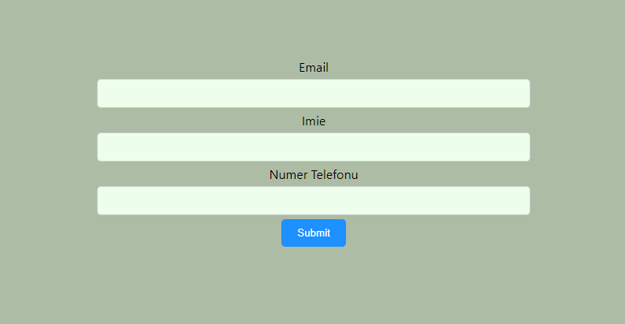
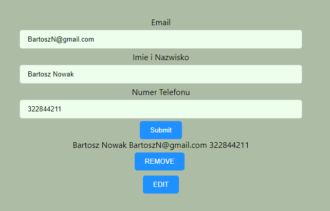
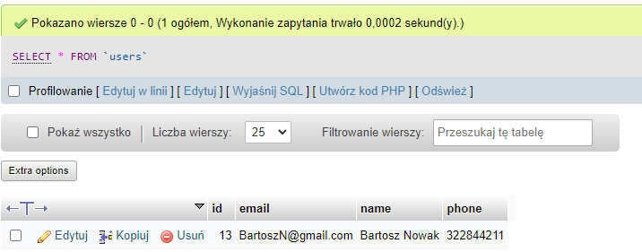
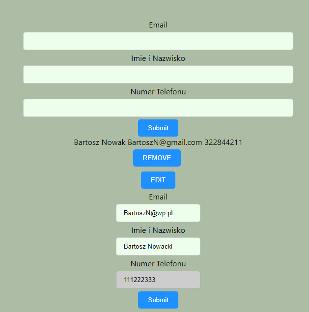
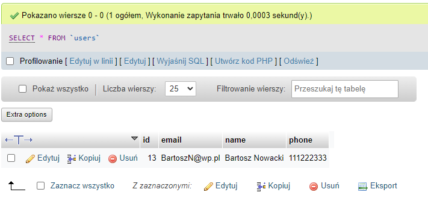

# Formularz (Zadanie Poprawkowe)

#### O projekcie

Aktualnie trwają prace nad projektem, w ramach którego użytkownicy mogą wprowadzać swoje dane, takie jak adres e-mail, imię oraz numer telefonu, za pomocą formularza. Wszystkie wprowadzone dane są przechowywane w bazie danych, a użytkownicy mają możliwość modyfikowania wcześniej wprowadzonych informacji.  

  

# Instrukcja instalacji i konfuguracji:

### Programy wymagane do otworzenia projektu
Aby rozpocząć pracę nad projektem, konieczne będzie zainstalowanie określonych programów na twoim komputerze. Wymagane aplikacje to:   
NodeJS:  <a href="https://nodejs.org/en/download/">https://nodejs.org/en/download/</a>  
XAMPP:  <a href="https://www.apachefriends.org/pl/index.html">https://www.apachefriends.org/pl/index.html</a>  

Aby móc pracować z projektem, konieczne jest uruchomienie modułów MySQL oraz Apache w panelu XAMPP. Upewnij się, że moduły zostały poprawnie uruchomione i są gotowe do przetwarzania danych. Pamiętaj, że poprawne działanie modułów jest kluczowe dla prawidłowego funkcjonowania projektu. 
 

Aby kontynuować, należy utworzyć bazę danych o nazwie "users" oraz zaimportować plik user.sql znajdujący się w katalogu "form". W ten sposób zostaną wprowadzone wymagane schematy i struktury do bazy danych. Upewnij się, że proces importowania przebiegnie pomyślnie przed przystąpieniem do kolejnych etapów projektu.

### Dalsza konfiguracja
Aby kontynuować, należy sklonować repozytorium projektu, a następnie otworzyć go w wybranym przez siebie edytorze kodu źródłowego. Następnie należy w terminalu wprowadzić następujące polecenia w kolejności:

`cd my-app` - przejście do folderu my-app  
`npm install` - zainstalowanie paczki node_modules  
`npm start` - uruchomienie servera 

Otwórz drugi terminal, a następnie wpisz poniższe komendy:

`cd server` - przejście do folderu server 
`npm install` - instalacja paczki node_modules w folderze server  
`node server.js` - uruchomienie pliku server.js   

Po wykonaniu wszystkich powyższych instrukcji, powinno nastąpić automatyczne uruchomienie serwera z formularzem. W przypadku, gdyby to się nie udało, należy wpisać w przeglądarce adres  localhost:3000 , aby uruchomić serwer ręcznie. Pamiętaj, aby upewnić się, że serwer działa poprawnie i formularz jest dostępny w przeglądarce internetowej.

# Działanie formularza

W celu przesłania danych do bazy danych, należy wypełnić formularz, wpisując odpowiednie informacje, takie jak adres e-mail, imię oraz numer telefonu. Po wpisaniu danych, należy kliknąć przycisk Submit, co spowoduje przesłanie wprowadzonych informacji do bazy danych. Pamiętaj, aby upewnić się, że dane zostały poprawnie wprowadzone i przesłane do bazy danych. 

